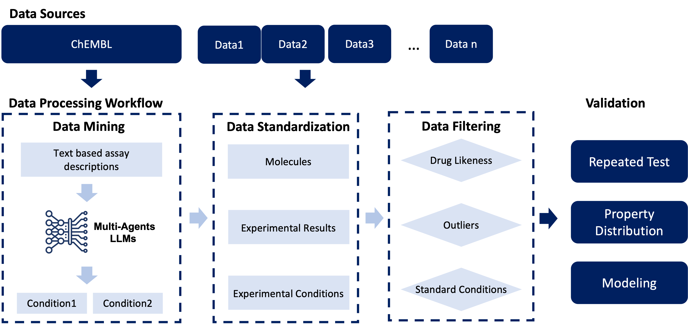

# PharmaBench

Source code for the paper "PharmaBench: Enhancing ADMET benchmarks with large language models"

We present PharmaBench, comprising a total of 156,618 raw entries, compiled from 14,401 bioassays. Researchers and scientists who would like to contribute data should contact the database's maintainers.

## Abstract


We propose a novel data mining approach that incorporates a multi-agent system based on Large Language Models (LLMs) to effectively identify experimental conditions within the descriptions of 14,401 bioassays. Additionally, we have proposed a data processing workflow to integrate data from various sources, totaling 156,618 raw entries. Through this workflow, we have constructed PharmaBench, a comprehensive benchmark set for ADMET properties, which includes eleven ADMET datasets and 52,482 entries. This benchmark set is designed to serve as an open-source dataset for the development of deep learning and machine learning models relevant to drug discovery projects. It is particularly aimed at research in transfer learning, pre-training, and explainable AI.



## Data Records


| Category             | Property Name     | Entries After Data Processing | Final Entries for AI modelling | Unit                | Mission Type  |
|----------------------|-------------------|-------------------------------|--------------------------------|---------------------|---------------|
| Physochemical        | LogD              | 14,141                        | 13,068                         | -                   | regression    |
|                      | Water Solubility  | 14,818                        | 11,701                         | log10nM             | regression    |
| Absorption           | BBB               | 12,486                        | 8,301                          | -                   | classification|
| Distribution         | PPB               | 1,310                         | 1,262                          | %                   | regression    |
| Metabolism           | CYP 2C9           | 4,507                         | 999                            | Log10uM             | regression    |
|                      | CYP 2D6           |                               | 1,214                          | Log10uM             | regression    |
|                      | CYP 3A4           |                               | 1,980                          | Log10uM             | regression    |
| Clearance            | HLMC              | 5,252                         | 2,286                          | Log10(mL.min-1.g-1) | regression    |
|                      | RLMC              |                               | 1,129                          | Log10(mL.min-1.g-1) | regression    |
|                      | MLMC              |                               | 1,403                          | Log10(mL.min-1.g-1) | regression    |
| Toxicity             | AMES              | 24,780                        | 9,139                          | -                   | classification|
| **Total**            |                   | **77,294**                    | **52,482**                     |                     |               |

## Usage

There are eleven ADMET datasets within PharmaBench. Standardized SMILES representations of compounds were provided for modeling the compounds, and the experimental values are provided as the prediction targets. Users may use the labels within the scaffold\_train\_test\_label and random\_train\_test\_label as the train-test labels for fair comparison.


The final datasets for PharmaBench are stored within the `data/final_datasets/` path and can be loaded with *pandas*:

```python
import pandas as pd

# load regression dataset
data = pd.read_csv("data/final_datasets/ames_cls_final_data.csv")

scaffold_training = data[data['scaffold_train_test_label'] == 'train']
scaffold_test = data[data['scaffold_train_test_label'] == 'test']

random_training = data[data['random_train_test_label'] == 'train']
random_test = data[data['scaffold_train_test_label'] == 'test']
```
The column descriptions are:

| Column Name                 | Description                                                                                   | Data Type |
|-----------------------------|-----------------------------------------------------------------------------------------------|-----------|
| Smiles_unify                | Standardized SMILES representation of compounds based on standardization methods described in the Data Standardization. | String    |
| value                       | Experimental values for different datasets including regression values and classification values | Float     |
| property                    | Different ADMET property name for the experiment                                              | String    |
| scaffold_train_test_label   | Training labels based on scaffold splitting, where 1 represents the training data and 0 represents the testing data. | Float     |
| random_train_test_label     | Training labels based on random splitting, where 1 represents the training data and 0 represents the testing data. | Float     |

## Working Environment Setting Up

We provide the requirements in [requirements.txt](requirements.txt). You may install the requirements file by:
```bash
conda create --name <env> --file requirements.txt
```


## Citation


The materials and data under this repo are distributed under the
[CC0 Licence](http://creativecommons.org/publicdomain/zero/1.0/).